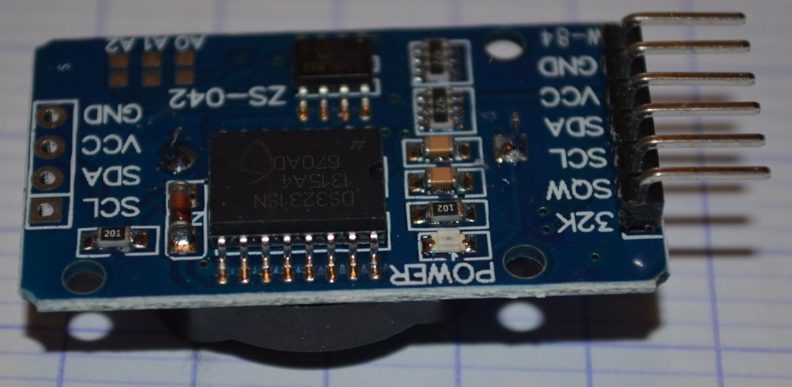
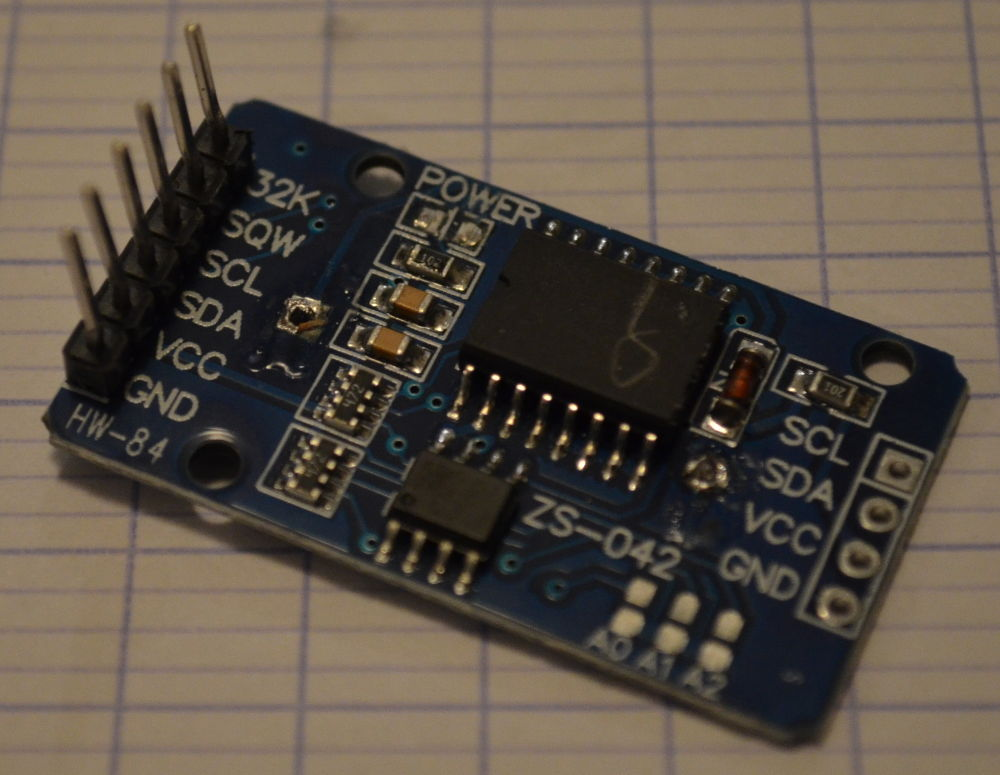
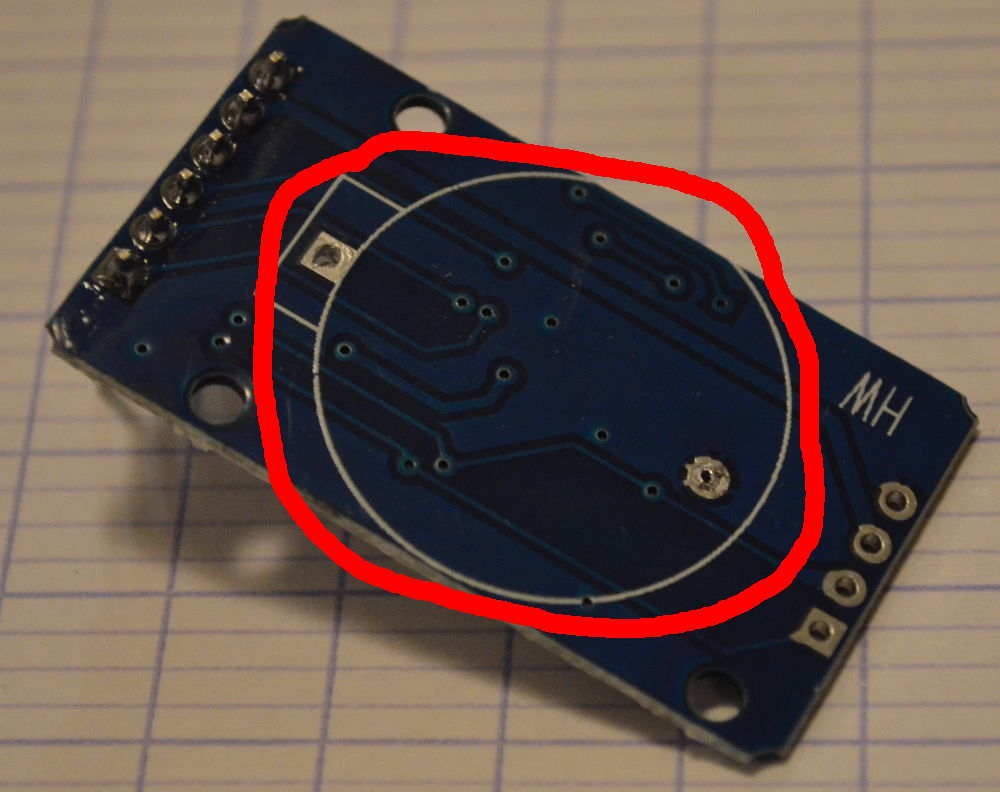
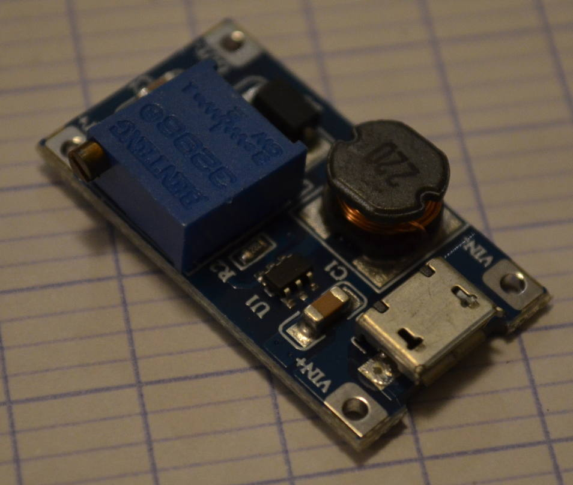
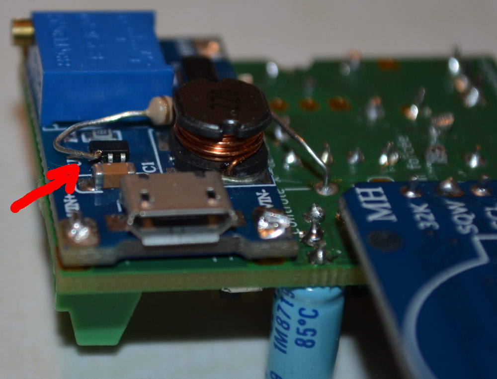
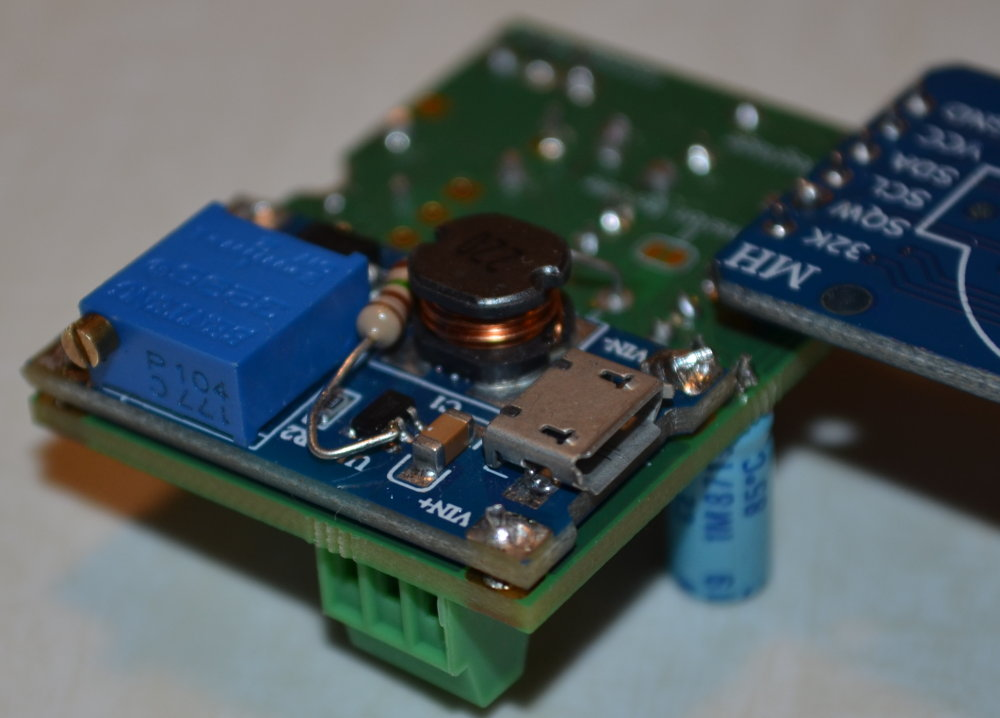
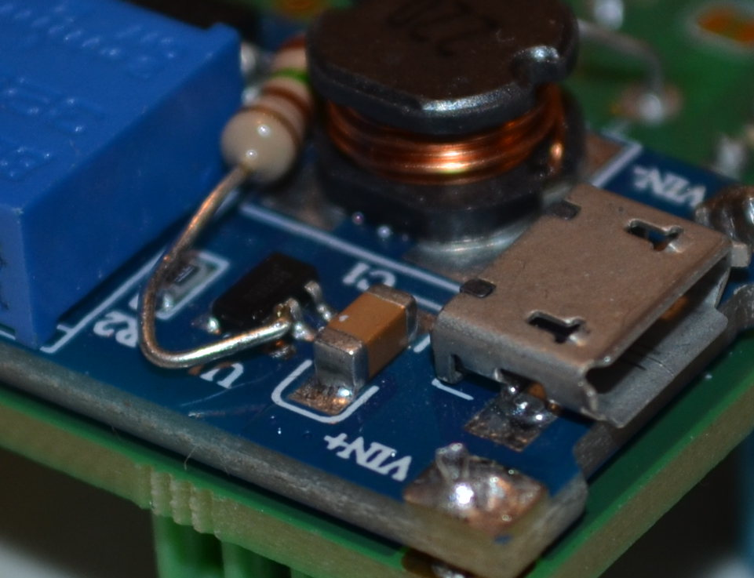
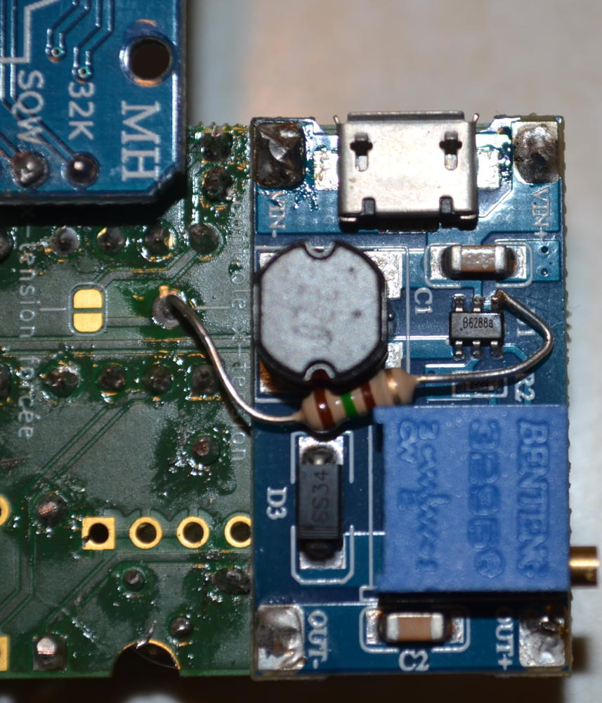
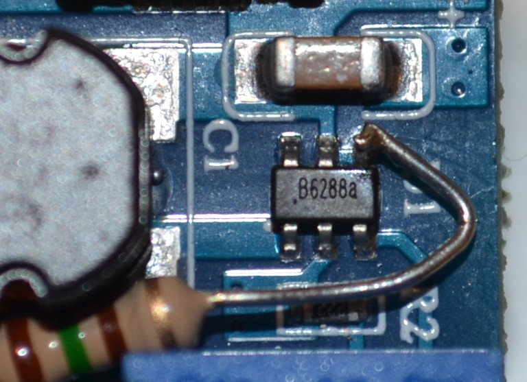

# Préparation des modules
<<<<<<< HEAD
<<<<<<< HEAD
<<<<<<< HEAD
<<<<<<< HEAD
<<<<<<< HEAD
<<<<<<< HEAD
<<<<<<< HEAD
=======
>>>>>>> 803b0aa... ajout images et instructions montage
=======
>>>>>>> 3cfb81d... mise à jour mineure description
## Module pont en H
### Où le trouver
De très nombreux sites en lignes proposent ces modules, importés de Chine. Chercher: module L9110

### Le préparer
 - Pour ne pas gaspiller d'énergie, supprimer la diode DEL marqué D1 avec le fer à souder.
 - Pour ne pas avoir d'erreur au montage, dessouder le bornier du coté non utilisé.

## Module RTC
### Où le trouver
De très nombreux sites en lignes proposent ces modules, importés de Chine. Chercher: module DS3231

### Le préparer
 - Pour ne pas gaspiller d'énergie, supprimer la diode DEL marqué power avec le fer à souder.

 - Pour ne pas être gêné par son volume, dessouder le support de pile. Elle n'est pas utile.

 - Pour que le montage final ne soit pas trop encombrant, redresser les 6 connecteurs de sortie.
## Module élévateur de tension (x-tension)
### Où le trouver
De très nombreux sites en lignes proposent ces modules, importés de Chine. Chercher: booster MT3608 micro USB

### Le préparer
Régler d'abord la tension de fonctionnement:
 - Relier le module à l'alimentation prévue pour le montage (**VIN+** et **VIN-**),
 - Relier un voltmètre à la sortie (**OUT+** et **OUT-**),
 - A l'aide d'un petit tournevis sur le potentiomètre bleu régler la tension de sortie selon les besoins de l'horloge (par exemple 24V).
Pour ne pas gaspiller d'énergie lors d'une utilisation non connectée au secteur, on peut utiliser la fonction ENABLE.
Ainsi le module consomme beaucoup moins au repos: on passe de ~1 milliampère à ~1 microampère.
(voir par exemple [cet article](https://hackaday.com/2019/01/27/reworking-mt3608-boost-converters-for-lower-idle-current-draw/), ou 
directement [la fiche technique](https://www.olimex.com/Products/Breadboarding/BB-PWR-3608/resources/MT3608.pdf))

Toutefois cette manipulation n'est pas obligatoire.
 - dessouder la patte du composant en la chauffant avec la panne du fer et la soulevant avec une aiguille
 - souder cette patte 'en l'air' à un fil ou une résistance (valeur peu importante - par exemple dans les 100 ohms)
 - souder l'autre extrémité du fil (ou de la résistance) sur la platine, au point **x-tension ENABLE**

<<<<<<< HEAD
<<<<<<< HEAD
=======
=======
>>>>>>> 0f36350... ajout images et instructions montage

=======
>>>>>>> 95d3729... Explications sur la préparation des modules, mise à jour programme
=======
>>>>>>> 9e35d87... correction nom fichier sketch arduino
=======
>>>>>>> 3e2009e... raz fichier préparation module
## Module pont en H
### Où le trouver
De très nombreux sites en lignes proposent ces modules, importés de Chine. Chercher: module L9110

### Le préparer
 - Pour ne pas gaspiller d'énergie, supprimer la diode DEL marqué D1 avec le fer à souder.
 - Pour ne pas avoir d'erreur au montage, dessouder le bornier du coté non utilisé.

## Module RTC
### Où le trouver
De très nombreux sites en lignes proposent ces modules, importés de Chine. Chercher: module DS3231

### Le préparer
 - Pour ne pas gaspiller d'énergie, supprimer la diode DEL marqué power avec le fer à souder.

 - Pour ne pas être gêné par son volume, dessouder le support de pile. Elle n'est pas utile.

 - Pour que le montage final ne soit pas trop encombrant, redresser les 6 connecteurs de sortie.
## Module élévateur de tension (x-tension)
### Où le trouver
De très nombreux sites en lignes proposent ces modules, importés de Chine. Chercher: booster MT3608 micro USB

### Le préparer
Régler d'abord la tension de fonctionnement:
 - Relier le module à l'alimentation prévue pour le montage (**VIN+** et **VIN-**),
 - Relier un voltmètre à la sortie (**OUT+** et **OUT-**),
 - A l'aide d'un petit tournevis sur le potentiomètre bleu régler la tension de sortie selon les besoins de l'horloge (par exemple 24V).
Pour ne pas gaspiller d'énergie lors d'une utilisation non connectée au secteur, on peut utiliser la fonction ENABLE.
Ainsi le module consomme beaucoup moins au repos: on passe de ~1 milliampère à ~1 microampère.
(voir par exemple [cet article](https://hackaday.com/2019/01/27/reworking-mt3608-boost-converters-for-lower-idle-current-draw/), ou 
directement [la fiche technique](https://www.olimex.com/Products/Breadboarding/BB-PWR-3608/resources/MT3608.pdf))

<<<<<<< HEAD
<<<<<<< HEAD
>>>>>>> 0f36350... ajout images et instructions montage
=======
>>>>>>> 803b0aa... ajout images et instructions montage
=======
>>>>>>> 0f36350... ajout images et instructions montage
=======
Toutefois cette manipulation n'est pas obligatoire.
 - dessouder la patte du composant en la chauffant avec la panne du fer et la soulevant avec une aiguille
 - souder cette patte 'en l'air' à un fil ou une résistance (valeur peu importante - par exemple dans les 100 ohms)
 - souder l'autre extrémité du fil (ou de la résistance) sur la platine, au point **x-tension ENABLE**

<<<<<<< HEAD
<<<<<<< HEAD
>>>>>>> 95d3729... Explications sur la préparation des modules, mise à jour programme
=======
=======

## Module pont en H

### Où le trouver
De très nombreux sites en lignes proposent ces modules, importés de Chine. Chercher: module L9110

### Le préparer
Pour ne pas gaspiller d'énergie, supprimer la diode DEL marqué D1 avec le fer à souder.
Pour ne pas avoir d'erreur au montage, dessouder le bornier du coté non utilisé.

>>>>>>> 0f36350... ajout images et instructions montage
>>>>>>> 3cfb81d... mise à jour mineure description

=======
>>>>>>> 9e35d87... correction nom fichier sketch arduino
=======
>>>>>>> 3e2009e... raz fichier préparation module

