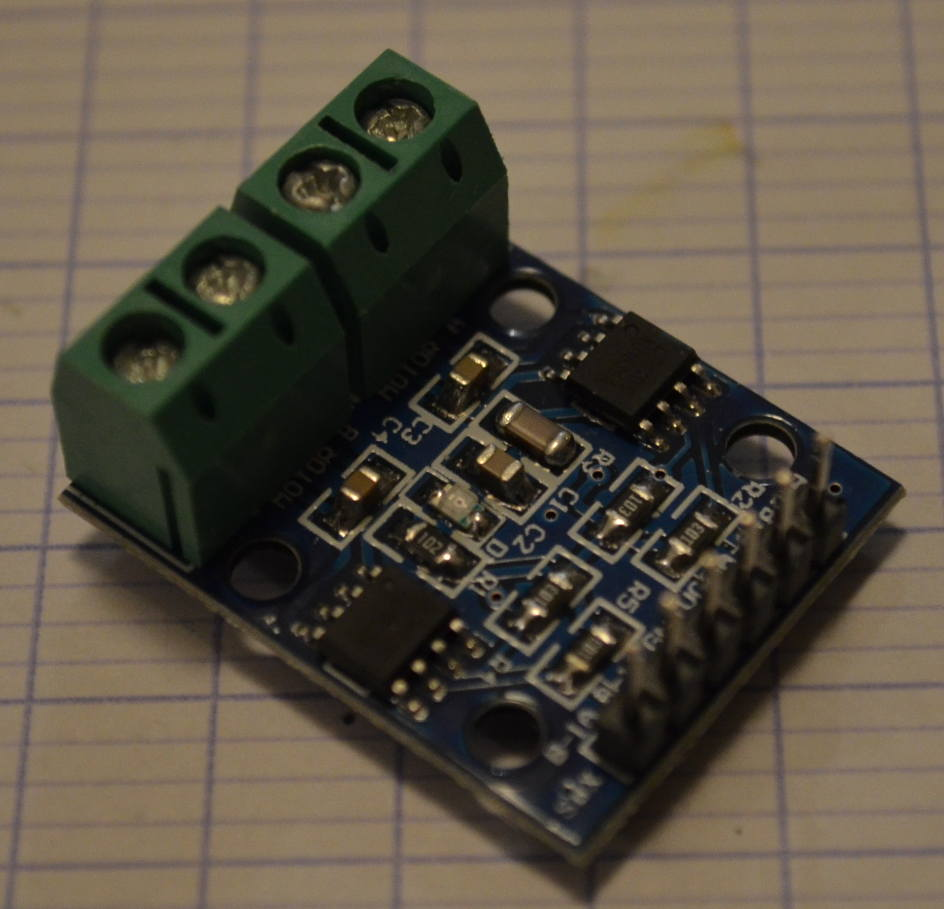
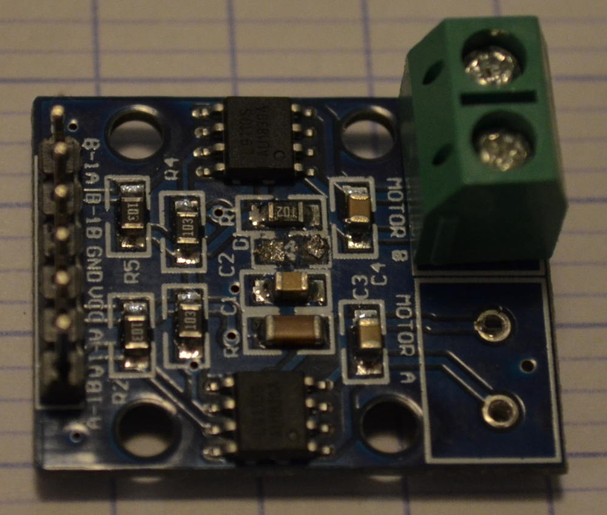

# Préparation des modules

## Module pont en H

### Où le trouver
De très nombreux sites en lignes proposent ces modules, importés de Chine. Chercher: module L9110

### Le préparer
Pour ne pas gaspiller d'énergie, supprimer la diode DEL marqué D1 avec le fer à souder.
Pour ne pas avoir d'erreur au montage, dessouder le bornier du coté non utilisé.

