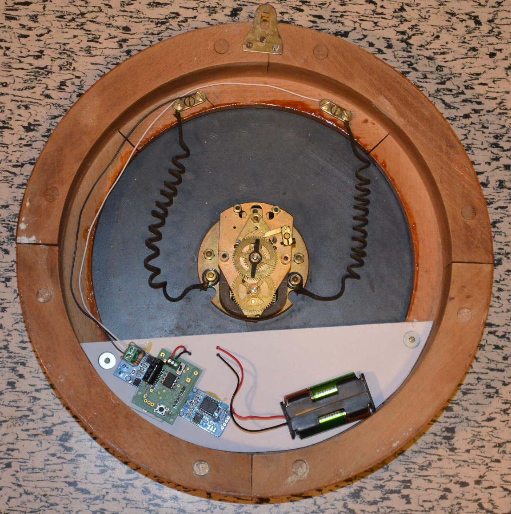

# Horloge électrique Brillié avec la mention 'rosace 10 ohms'
## Identification


## Caractéristiques
Il s'agit d'un modèle à impulsions alternées toutes les 30s.
Cette horloge peut être alimentée directement par un bloc de piles AA (2x1,5V = 3V). Sur deux accus NiMh assez vieux, elle tient **A mettre à jour**.
## Options pour le programme.
On peut utiliser les réglages suivants pour le mode de fonctionnement en double pas
```
// ---- CONFIGURATION ----
#define alternee // Pour une horloge qui a besoin d'impulsions de polarité altérnées
#define pas30 // Pour une horloge dont le pas correspondant à une impulsion est de 30s
#define doublepas // Pour une horloge dont le pas est 30s, génère plutôt 2 impulsions rapprochées toutes les 60s 
#define d_pause 100 // Durée pause entre 2 impulsions alternées en millisecondes
#define d_pas_1 8  // Durée impulsion sur broche 1 pour les impulsions alternées
#define d_pas_2 10  // Durée impulsion sur broche 2 pour les impulsions alternées
// ----      FIN      ----
```
Pour une impulsion toutes les 30 secondes (temps plus important pour le pas 1 pour mieux aligner l'aiguille):
```
// ---- CONFIGURATION ----
#define alternee // Pour une horloge qui a besoin d'impulsions de polarité altérnées
#define pas30 // Pour une horloge dont le pas correspondant à une impulsion est de 30s
#define d_pas_1 10  // Durée impulsion sur broche 1 pour les impulsions alternées
#define d_pas_2 10  // Durée impulsion sur broche 2 pour les impulsions alternées
// ----      FIN      ----
```
## Suggestion de présentation



